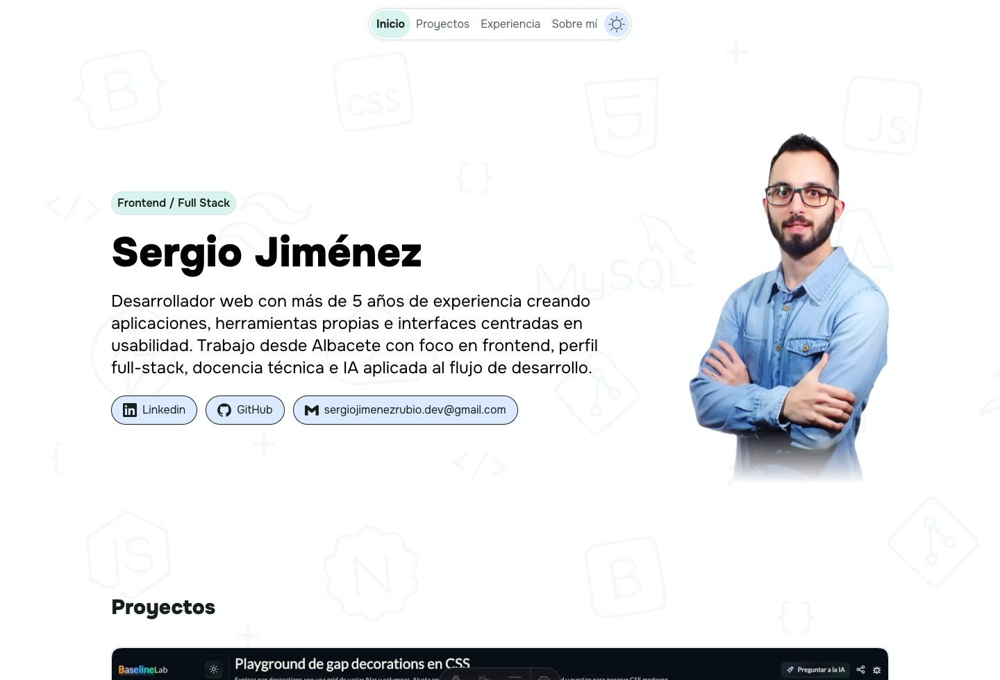
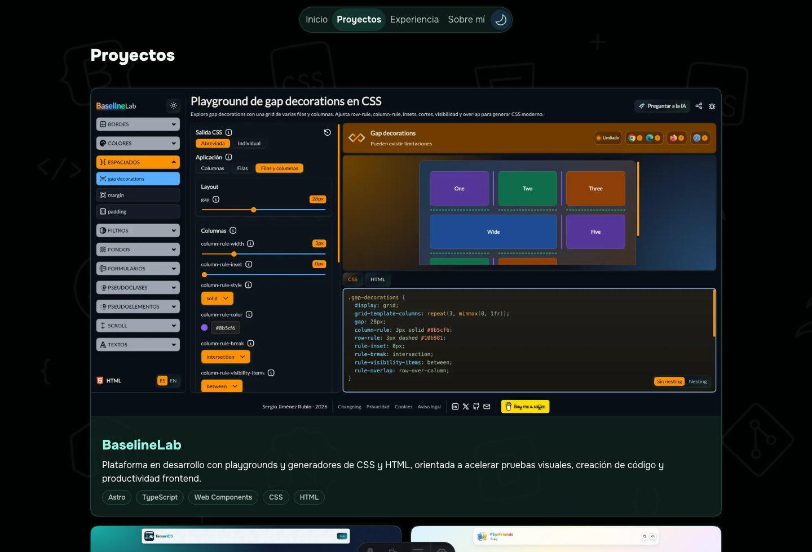
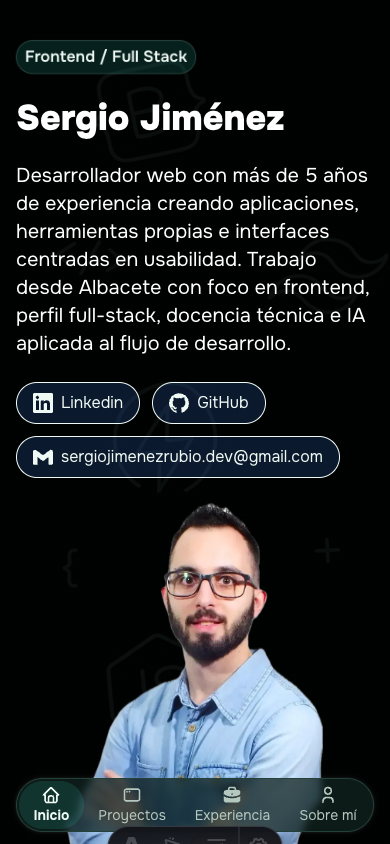

# Portfolio de Sergio Jiménez Rubio

Repositorio del portfolio personal de Sergio Jiménez Rubio, desarrollado con Astro y Tailwind CSS. El objetivo del proyecto es mostrar mi perfil como desarrollador Frontend / Full Stack, documentar proyectos destacados y dejar visible cómo está construido el sitio para que pueda revisarse en público.

## Redes

<p>
  <a href="https://www.linkedin.com/in/sergio-jim%C3%A9nez-rubio/" target="_blank" rel="noopener noreferrer">
    
  </a>
  <a href="https://x.com/sergiojr_dev" target="_blank" rel="noopener noreferrer">
    
  </a>
</p>

## Capturas

### Inicio en desktop



### Proyectos en modo oscuro



### Vista móvil



## Stack

- Astro 6
- TypeScript
- Tailwind CSS 4
- Astro Assets para optimización de imágenes y fuentes
- Vercel Analytics
- Fuente local Onest

## Qué incluye

- Home one-page con navegación por secciones.
- Sección de proyectos con imágenes optimizadas y enlaces externos.
- Timeline de experiencia y estudios.
- Bloque "Sobre mí" con highlights visuales.
- Tema claro/oscuro con persistencia en `localStorage`.
- Transición visual del cambio de tema cuando el navegador soporta View Transitions.
- Metadatos SEO, Open Graph, Twitter Cards y JSON-LD de tipo `Person`.
- `robots.txt` generado desde Astro.
- Diseño responsive con navegación inferior en móvil.

## Estructura del proyecto

```text
/
├── public/
│   ├── favicon.png
│   └── images/
│       ├── bg-dark.webp
│       ├── bg-light.webp
│       └── readme/
├── src/
│   ├── assets/
│   │   ├── fonts/
│   │   ├── icons/
│   │   └── images/
│   ├── components/
│   ├── layouts/
│   ├── pages/
│   └── styles/
├── astro.config.mjs
├── package.json
├── pnpm-lock.yaml
└── pnpm-workspace.yaml
```

Las páginas viven en `src/pages/`, los componentes reutilizables en `src/components/`, la configuración de SEO y el layout base en `src/layouts/Layout.astro`, y los tokens visuales globales en `src/styles/global.css`.
