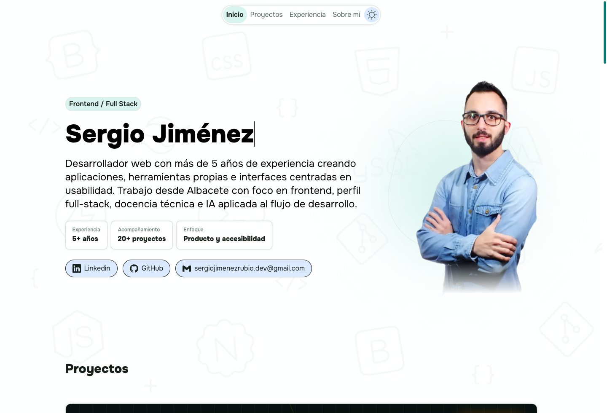
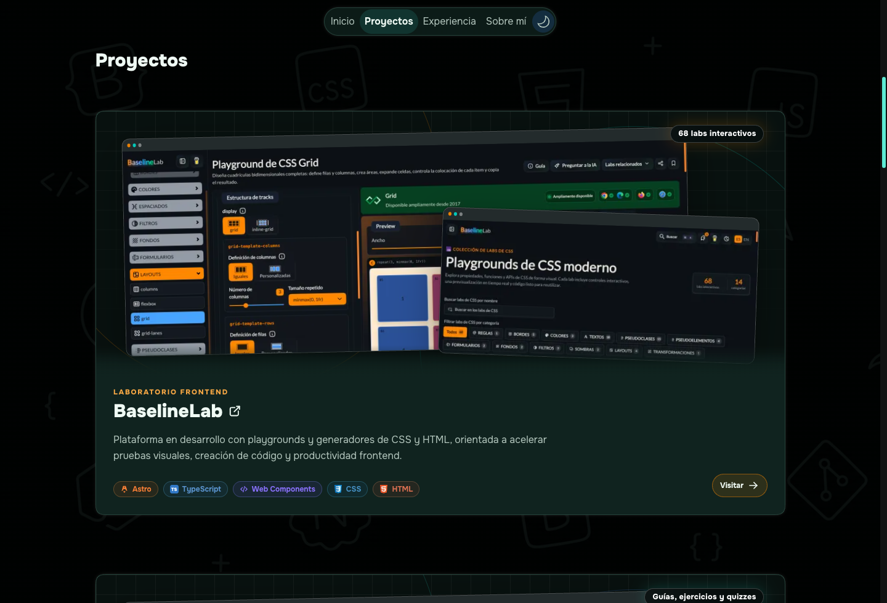
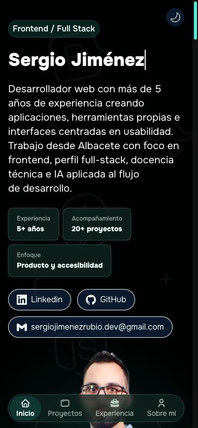

# Portfolio de Sergio Jiménez Rubio

Portfolio personal desarrollado con Astro, TypeScript y Tailwind CSS. Presenta mi perfil como desarrollador Frontend / Full Stack, mi trayectoria y una selección de productos en los que he trabajado, con especial atención a la usabilidad, la accesibilidad y el detalle visual.

## Redes

<p>
  <a href="https://www.linkedin.com/in/sergio-jim%C3%A9nez-rubio/" target="_blank" rel="noopener noreferrer">
    
  </a>
  <a href="https://x.com/sergiojr_dev" target="_blank" rel="noopener noreferrer">
    
  </a>
</p>

## Capturas

### Inicio en escritorio · tema claro



### Proyectos en escritorio · tema oscuro



### Inicio en móvil · tema oscuro



## Stack

- Astro 7
- TypeScript 6
- Tailwind CSS 4
- Astro Assets y Astro Fonts
- Vercel Analytics y Speed Insights
- Fuente variable local Onest

## Qué incluye

- Home de una sola página con navegación activa por secciones.
- Proyectos destacados en tarjetas apilables con capturas optimizadas, tecnologías y enlaces externos.
- Trayectoria profesional y formación con detalles desplegables.
- Secciones dedicadas al proceso de trabajo, perfil profesional y contacto.
- Tema claro/oscuro con persistencia en `localStorage`.
- Transición de tema mediante View Transitions cuando el navegador lo permite.
- Experiencia responsive con navegación inferior y selector de tema independiente en móvil.
- Preferencias de movimiento reducido, enlace para saltar al contenido y estados de foco visibles.
- Metadatos SEO, Open Graph, Twitter Cards y JSON-LD de tipo `Person`.
- `robots.txt` generado como endpoint de Astro.

## Estructura del proyecto

```text
/
├── public/
│   ├── favicon.png
│   └── images/
│       ├── bg-dark.webp
│       ├── bg-light.webp
│       └── readme/
├── src/
│   ├── assets/
│   │   ├── fonts/
│   │   ├── icons/
│   │   └── images/
│   ├── components/
│   │   ├── experience/
│   │   ├── header/
│   │   ├── projects/
│   │   ├── shared/
│   │   └── start-description/
│   ├── layouts/
│   ├── pages/
│   └── styles/
├── astro.config.mjs
├── package.json
├── pnpm-lock.yaml
└── pnpm-workspace.yaml
```

Las rutas viven en `src/pages/`, los componentes se agrupan por área en `src/components/`, el layout base y los metadatos están en `src/layouts/Layout.astro`, y los tokens visuales, temas y animaciones globales se definen en `src/styles/global.css`.
